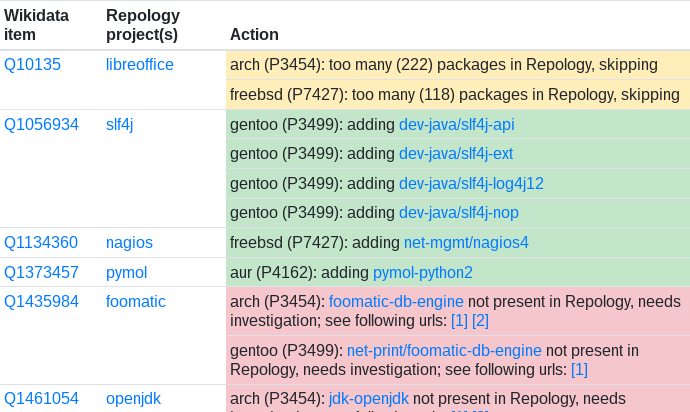

# Repology wikidata bot

[](https://travis-ci.org/repology/repology-wikidata-bot)

Update Wikidata entries using information from Repology.

This bot iterates over software projects listed [Repology](https://repology.org/) which have associated (by specifying [Repology project name](https://www.wikidata.org/wiki/Property:P6931) property for a software project in Wikidata) Wikidata entry, and fills package information (such as [Gentoo package](https://www.wikidata.org/wiki/Property:P3499) property).

<p align="center">
	
</p>

## Dependencies

- [Python](https://www.python.org/) 3.7+
- Python module [Jinja2](https://jinja.palletsprojects.com/)
- Python module [pywikibot](https://pypi.org/project/pywikibot/)
- Python module [requests](https://pypi.org/project/requests/)

Modules can be installed with `pip install -r requirements.txt` command.

## Running

The bot would run out of box, without any required arguments to specify,
however if you're going to use another bot account than [Repology
bot](https://www.wikidata.org/wiki/User:Repology_bot), you'll need to edit
`user-config.py` accordingly first.

By default, the bot processes all available projects (may take some time),
and works with all supported package properties. It would list all changes
it's going to make and ask you before doing any modifications, so running it
just to see how it goes is safe.

The intended workflow is to run the bot with `--html <output file>` option to
generate a verbose report, review the report and then confirm it's actions to
perform modifications to Wikidata. You shouldn't generally need options apart
from `--html`, but at start you may also use something like `--from a --to b`
to limit operation on a fraction of projects (here: on projects starting with
`a` letter), to get results faster and have a smaller set of items to review.

The bot generates a set of so called _actions_, which describe changes to be
made, but it doesn't support performing all of them on its own - in fact, most
actions are informational or need a manual intervention.

### Types of actions

- Add property (displayed as green in reports). This is the only kind of action
  the bot may perform on its own. It's going to add missing properties to Wikidata.
- Remove property (displayed as red). This suggests that a property present in
  Wikidata is absent in Repology, either before Repology has incomplete data
  or because the package was in fact removed and Wikidata should be updated
  accordingly (by adding "end time" qualifier). Since this is unreliable and
  requires manual confirmation (and digging for relevant reference url), this
  is to be performed manually. The bot supplies some useful URLs to help with
  digging.
  - Subset of this is when property with "no data" value is encountered
    in Wikidata: this is likely an error and should be removed right away.
- Skip some entries due to various reasons
  - Too many (more than 50) properties to add. Because I'm hesitant to spam
    Wikidata with 100 i18n packages in each repository for e.g. firefox and
    libreoffice. Feed free to contact me if you think this is OK, also it may
    be tuned from the command line with `--max-entries` argument.
  - Multiple Wikidata entries for a single Repology project. This is likely an
    error, no such cases ATOW.

### Example run

```
% ./repology-wikidata-bot.py --html report.html
Gathering projects from Repology [3311]...
Comparing to Wikidata [3273/3273, 0:00:00 remaining]...
Listing actions
===> Q10135 / libreoffice
arch (P3454): too many (222) packages in Repology, skipping
freebsd (P7427): too many (118) packages in Repology, skipping
===> Q1056934 / slf4j
gentoo (P3499): adding dev-java/slf4j-api
gentoo (P3499): adding dev-java/slf4j-ext
gentoo (P3499): adding dev-java/slf4j-log4j12
gentoo (P3499): adding dev-java/slf4j-nop
===> Q1134360 / nagios
freebsd (P7427): adding net-mgmt/nagios4
===> Q1373457 / pymol
aur (P4162): adding pymol-python2
===> Q2002007 / texlive
arch (P3454): texlive-core not present in Repology, needs investigation; see following urls:
  https://git.archlinux.org/svntogit/packages.git/log/trunk?h=packages/texlive-core
  https://git.archlinux.org/svntogit/community.git/log/trunk?h=packages/texlive-core
Apply listed changes [Y/n]? y             ← check report.html before confirming
Applying actions [8/8, 0:00:00 remaining]...
%
```

As you can see, it adds missing Arch, FreeBSD, Gentoo and AUR package properties
for _slf4j_, _nagios_ and _pymol_, skips _libreoffice_ due to a lot of packages, and
complains on _texlive-core_ specified in Wikidata as Arch package for _texlive_,
but absent in Repology (and here it's Repology problem as texlive project is not
fully merged there yet).

### Blacklist

You may exclude some Repology projects or Wikidata items from processing through
`blacklist.txt` file. The most common reasons for this is postponing some projects
or handling discrepancies between Repology and Wikidata (for example, when a project
and its fork are single entity in one place, but split in another). Hopefully the
blacklist would shrink with time, as discrepancies may be solved from both Repology
and Wikidata sides after some analysis.

## Links

* [List of projects](https://repology.org/projects/?inrepo=wikidata) linked to Wikidata in Repology
* Bot's [User page](https://www.wikidata.org/wiki/User:Repology_bot) on Wikidata
* Author's [User page](https://www.wikidata.org/wiki/User:AMDmi3) on Wikidata

## Author

* [Dmitry Marakasov](https://github.com/AMDmi3) <amdmi3@amdmi3.ru>

## License

GPLv3 or later, see [COPYING](COPYING).
